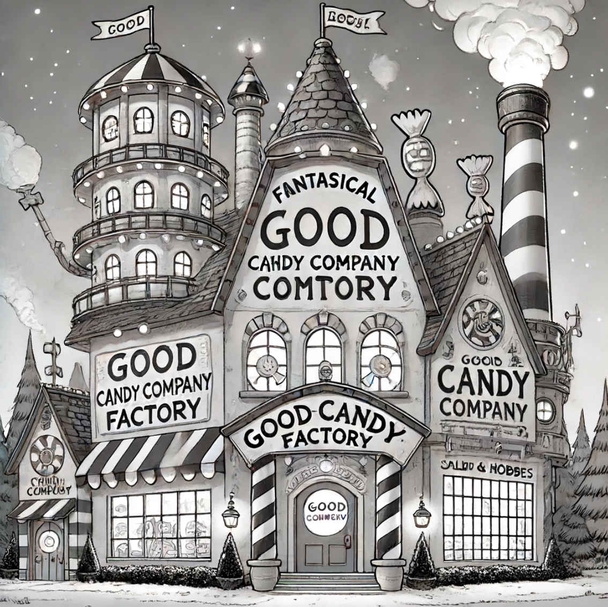
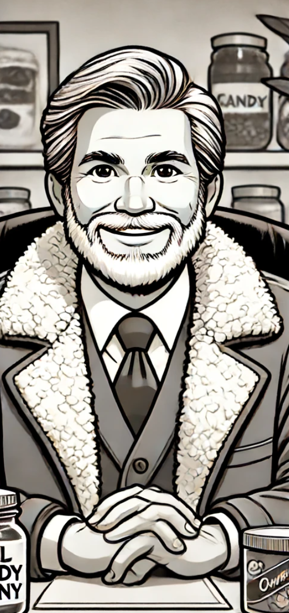
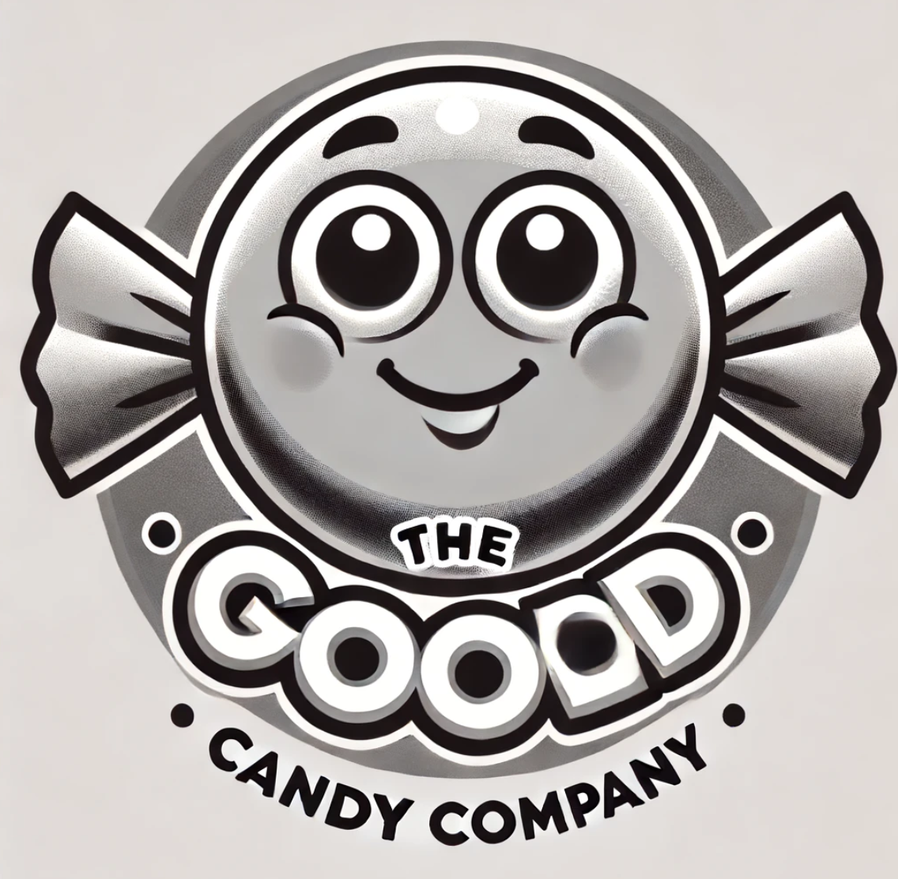
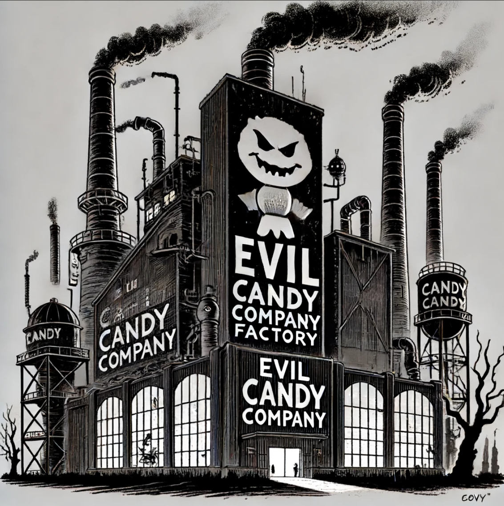
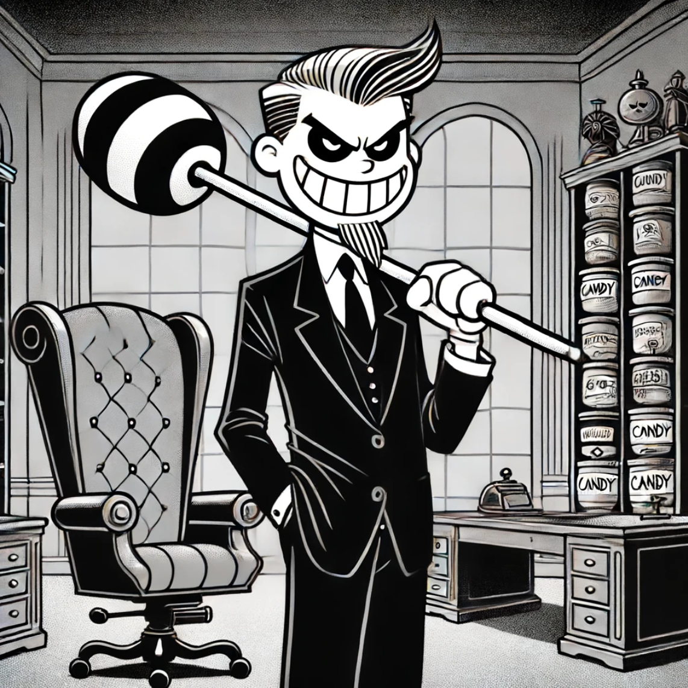

# Overview

## Overview of the Story

### The Good Candy Company

Known for making high-quality candy that is enjoyable but does not overload or addict children.

### The Evil Candy Company

Moves into the market with candy filled with excessive sugar and fructose, aiming to addict children without any regard for their health.

### The Impact on Children

As children become addicted to the evil candy, their dental health deteriorates, leading to an increase in lost teeth.

### The Tooth Fairy Overload

The surge in lost teeth overwhelms the Tooth Fairy, causing her immense stress and fatigue.

### Evie's Encounter with the Tooth Fairy

One night, a six-year-old girl named Evie finds the Tooth Fairy passed out in her room due to exhaustion.
Evie wakes up the Tooth Fairy, who then asks Evie for her help.

### Evie's Journey

In the subsequent chapters, Evie learns the ropes of being a Tooth Fairy and understands the magnitude of the problem caused by the Evil Candy Company.
Evie and the Tooth Fairy devise a plan to combat and eventually destroy the Evil Candy Company to restore balance and protect the children's health.

## Learning the Ropes

### Introduction to Tooth Fairy Duties

The Tooth Fairy, still recovering, begins teaching Evie the basics of her duties. Evie learns how to collect teeth, the magic involved in transforming them into fairy dust, and the importance of maintaining children's belief in the Tooth Fairy.
Evie is introduced to the Tooth Fairy's magical world, including the Tooth Fairy's home, a hidden realm filled with other fairies, enchanted tools, and a magical library with ancient texts about fairy lore.

### Understanding the Problem

The Tooth Fairy explains the severity of the situation caused by the Evil Candy Company. She shows Evie the rising numbers of children with cavities and dental issues, and the strain it places on the Tooth Fairy system.
The Tooth Fairy highlights how the Evil Candy Company exploits children’s desires and vulnerabilities for profit, demonstrating the consequences of greed and unchecked capitalism.
Evie meets other fairies who are also struggling with the overwhelming workload and learns about the emotional toll it has taken on them.

### Devising the Plan

#### Gathering Allies, The Smile Squad

Evie and the Tooth Fairy decide they need help to fight the Evil Candy Company. They reach out to the Good Candy Company for support, as well as other magical creatures and beings who care about children's health.
They form a coalition that includes the Good Candy Company, other fairies, and even some reformed members of the Evil Candy Company who have seen the harm caused by their products.

#### Research and Strategy

Using the magical library, Evie and the Tooth Fairy research ancient spells and strategies to counteract the addictive properties of the evil candy.
They devise a multi-faceted plan that includes creating a healthier, irresistible candy alternative and launching a campaign to educate children and parents about the dangers of the Evil Candy Company's products.
They also plan to expose the exploitative practices of the Evil Candy Company, revealing how its pursuit of profit harms children and society.

#### Magical Intervention

The Tooth Fairy and her allies enchant the Good Candy Company's products with a special magic that not only makes them delicious but also helps strengthen children's teeth.
They also create protective charms that children can wear, which help resist the addictive pull of the evil candy.

### The Battle

#### Launching the Campaign

Evie and the coalition launch their educational campaign, spreading awareness through magical means and community efforts. They use enchanted flyers, magical performances, and engaging stories to captivate the children and their families.
The Good Candy Company introduces their new line of enchanted candies, which quickly gain popularity.
The campaign also includes a strong message against the exploitation of children’s health for corporate gain, emphasizing the importance of ethical business practices.

#### Direct Confrontation

As the Evil Candy Company realizes their sales are plummeting, they attempt to sabotage the efforts of Evie and the Tooth Fairy.
Evie, the Tooth Fairy, and their allies engage in a series of magical confrontations with the Evil Candy Company's minions, using their newfound knowledge and powers to defend themselves and continue their mission.
During these confrontations, they uncover and reveal the corrupt practices of the Evil Candy Company, rallying public support against the corporation.

### Victory and Restoration

After a final showdown with the head of the Evil Candy Company, Evie and the Tooth Fairy manage to defeat them by breaking the enchantment that made the evil candy so addictive.
The Evil Candy Company is dismantled, and its resources are redirected towards producing healthy and ethical products.
The downfall of the Evil Candy Company serves as a cautionary tale about the dangers of prioritizing profit over well-being and ethics.

### Epilogue

With the Evil Candy Company defeated, the balance is restored. Children's dental health improves, and the Tooth Fairy system returns to normal.
Evie is celebrated as a hero in both the human and fairy worlds. She continues to help the Tooth Fairy on special missions and remains a guardian of children's health and happiness.
The story ends with Evie looking forward to new adventures, knowing that she has made a significant difference in the world and helped combat the evils of exploitative capitalism.